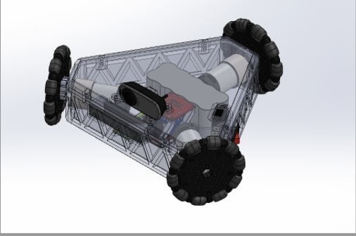

# <ins>Academic Research</ins>
---
#### _Biomimetic Millisystems Laboratory_

| MRI Safe Robotics | Description  |
| :-------------: | :-------------: |
| Insert Image  | I participated in the research and development of brain stimulating robotics. This research mainly focused on deliverables relating to a non magnetic 7-axis robot arm for uses in medical settings  |

#### _Additive Manufacturing and Meta Materials Laboratory_

| Characterizing Resin Crystal Growth Orientation |
| ------------- | ------------- |
| Image  | Propagation of Crystal Seed Growth  |

# <ins>Extracurriculars</ins>
---
#### _STAR_
#### _SEB_ 
#### _HOPE_
#### _TPREP_

# <ins>Engineering Projects</ins>
---
#### _Lyra - 6 Axis Robot Arm_

| Lyra - 6 axis Robot Arm |
| ------------- | ------------- |
| Image  | LYRA is a meter-long 7-axis robot arm with an interchangeable toolhead system for multiuse capabilities |

#### _LITS - 6 Axis Force Torque Sensor_

| LITS|
| ------------- | ------------- |
| Image  | LYRA is a meter-long 7-axis robot arm with an interchangeable toolhead system for multiuse capabilities |

#### _Custom Laminated Composite for Pressurized COPV_

| Custom Composite |
| ------------- | ------------- |
| Image  | LYRA is a meter-long 7-axis robot arm with an interchangeable toolhead system for multiuse capabilities |

#### _KIWI Bot - Omnidirectional Drone_

| KIWI Bot - Omnidirectional Drone |   |
| ------------- | :-------------: |
|   LYRA is a meter-long 7-axis robot arm with an interchangeable toolhead system for multiuse capabilities | 

#### _Wind Turbine_

| | Wind Turbine |
| ------------- | :-------------: |
| Insert Image Here | LYRA is a meter-long 7-axis robot arm with an interchangeable toolhead system for multiuse capabilities |

